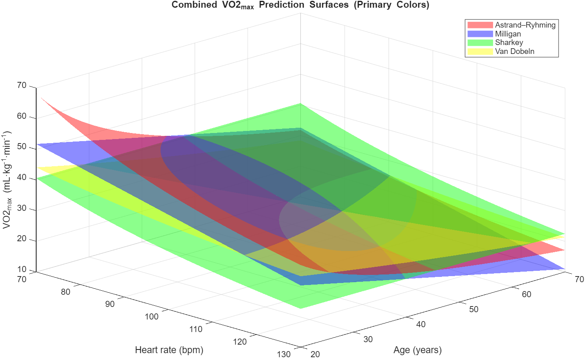

# VO2_submax_equations

## Comparisons of some equations to estimate VO2max from submaximal exercise tests. 
This repo is based on work published in:
Hughes AD, Chaturvedi N. Estimation of Maximal Oxygen Consumption and Heart Rate Recovery Using the Tecumseh Sub-Maximal Step Test and their Relationship to Cardiovascular Risk Factors. *Artery Res* 2017; 18: 29-35.
& Hughes AD, Chaturvedi N. Corrigendum to "Estimation of maximal oxygen consumption and heart rate recovery using the Tecumseh sub-maximal step test and their relationship to cardiovascular risk factors" [Artery Research 18 (June 2017) 29-35]. *Artery Res* 2021; 27(1): 51.

Some aspects of the methodology in this publication could have been clearer! For some calculations we used heart rate measured over 30s (as was used in the source papers) but this could have been better described in the methods of our paper (hence the corrigendum). 
This repo updates this work to an extent and I hope makes the calculations clearer and allows a directed comparison of the equations. 
The fits shown are slightly different from those in Hughes & Chaturvedi 2017 as they now also include the Astrand Ryhming equation. At present all this is work in progress as I plan to include the sex specific equations when time allows. 

ADH
